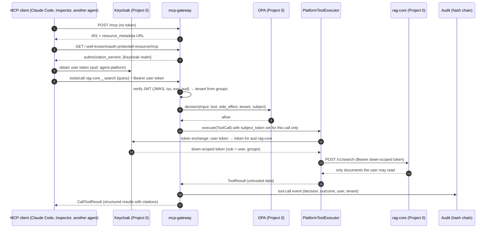

# Sequence: an external MCP client calls rag-core/search through the gateway (Step 8)

```mermaid
sequenceDiagram
  autonumber
  participant C as MCP client (Claude Code, Inspector, another agent)
  participant K as Keycloak (Project 0)
  participant G as mcp-gateway
  participant O as OPA (Project 0)
  participant E as PlatformToolExecutor
  participant R as rag-core (Project 0)
  participant A as Audit (hash chain)
  C->>G: POST /mcp (no token)
  G-->>C: 401 + resource_metadata URL
  C->>G: GET /.well-known/oauth-protected-resource/mcp
  G-->>C: authorization_servers: [Keycloak realm]
  C->>K: obtain user token (aud: agent-platform)
  C->>G: tools/call rag-core__search {query} + Bearer user token
  G->>G: verify JWT (JWKS, iss, exp, aud) → tenant from groups
  G->>O: decision(input: tool, side_effect, tenant, subject)
  O-->>G: allow
  G->>E: execute(ToolCall) with subject_token set for this call only
  E->>K: token exchange: user token → token for aud rag-core
  K-->>E: down-scoped token (sub = user, groups)
  E->>R: POST /v1/search (Bearer down-scoped token)
  R-->>E: only documents the user may read
  E-->>G: ToolResult (untrusted data)
  G->>A: tool.call event (decision, outcome, user, tenant)
  G-->>C: CallToolResult (structured results with citations)
```
