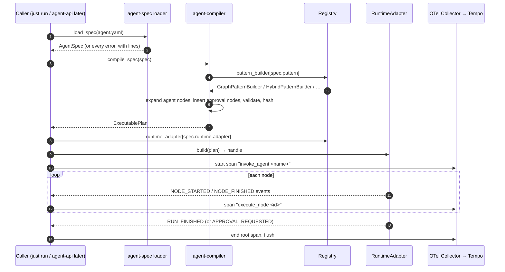

# Sequence: one run, from spec to trace (Step 4)

```mermaid
sequenceDiagram
  autonumber
  participant U as Caller (just run / agent-api later)
  participant L as agent-spec loader
  participant C as agent-compiler
  participant R as Registry
  participant A as RuntimeAdapter
  participant O as OTel Collector → Tempo
  U->>L: load_spec(agent.yaml)
  L-->>U: AgentSpec (or every error, with lines)
  U->>C: compile_spec(spec)
  C->>R: pattern_builder[spec.pattern]
  R-->>C: GraphPatternBuilder / HybridPatternBuilder / …
  C->>C: expand agent nodes, insert approval nodes, validate, hash
  C-->>U: ExecutablePlan
  U->>R: runtime_adapter[spec.runtime.adapter]
  U->>A: build(plan) → handle
  U->>O: start span "invoke_agent <name>"
  loop each node
    A-->>U: NODE_STARTED / NODE_FINISHED events
    U->>O: span "execute_node <id>"
  end
  A-->>U: RUN_FINISHED (or APPROVAL_REQUESTED)
  U->>O: end root span, flush
```
